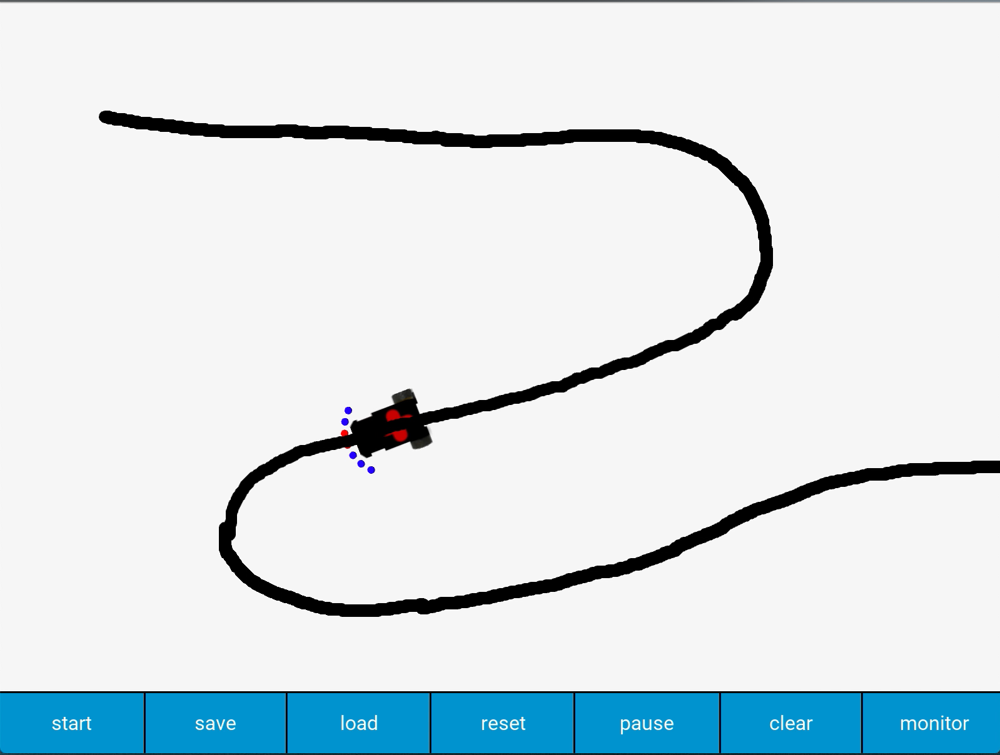
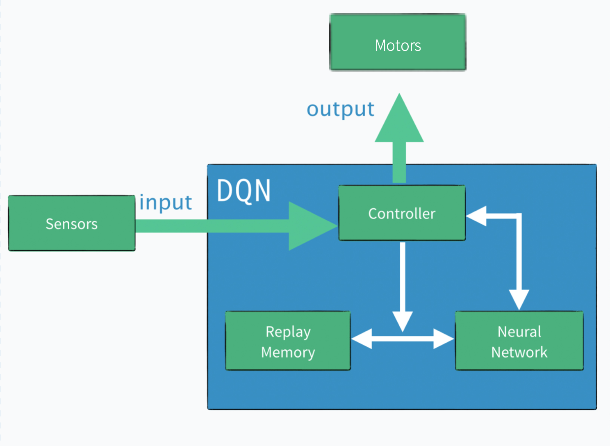

# PathFinding Agent with Deep Reinforcement Learning
This project was done as a part of my **B.Sc. Thesis** under supervision of Dr. Mehdi Sedighi, Computer Engineering Department, Tehran Polytechnic.
The aim was to implement a **reinforcement learning** algorithm to train a pathfinding agent to follow the path it's intended to follow.
I've defined the project to be as follow:

1.  The algorithm to be implemented is the famouse DQN algorithm, introduced in <a href=https://www.cs.toronto.edu/~vmnih/docs/dqn.pdf  style="color:#00c890">this paper</a>
2.  The implementation should be done in a virtual simulation environment, using python language.
---
**<bold class="text-elite">Step 1</bold>**

The first step was to design a simulation environment. Kivy framework is used for this purpose. An agent with seven sensors (adjustable) starts in a specific position on a white field, the user can draw lines on the field and the agent is able to percept those lines with its sensors.



---
**<bold class="text-elite">Step 2</bold>**

Pytorch library is used for highlevel implementation of DQN. For better exploration, epsillon-greedy method is used.

Hyperparameters were obtained as follow:

1. learningrate = 0.001
2. input layer neurons = 7
3. output layer neurons = 3 (corresponding to three different movements)
4. hidden layer neurons = 10
5. activation function for neurons = ReLU
6. gamma = 0.9
7. reward = 0.1
8. punishment (negative reward) = -1
9. epsillon-greedy iterations = 2500
10. epsillon-greedy initial probability = 0.5

---
**<bold class="text-elite">Step 3</bold>**

Implementation is done with fully numpy framework with object-oriented methodology.



---

**<bold class="text-elite">Step 4</bold>**

Added a config.py file to have control on simulation. It would be as follow:

```python
learningCoreSettings = {
    # Number of hidden layer neurons (For three inputs, 8 to 16 neurons work like charm)
    "nNeurons" : 10,
    # Discount factor (Somewhere between 0.8 and 0.9 is ok)
    "gamma" : 0.9,
    # Replay memory capacity (10000 is more than enough)
    "memoryCapacity" : 10000,
    # Learning-rate (Somewhere between 0.0001 to 0.005 is ok) 
    "learningRate" : 0.001,
    # BatchSize, number of samples taken from replay memory in each Learning Iteration
    "batchSize" : 25,
    # Non-linear activation function for neurons, ReLU is used in this project but you may implement others 
    "activationFunction" :"relu",
    # Number of outputs, can be set to 3 (Its not generic yet)
    "nOutputs" : 3,
    # Number of inputs, can be set to 3 or 7 (Its not generic yet)
    "nInputs" : 3,
    # Regularization factor, for now its just implemented in manual design
    "reg" : 0,  
    # AI Backend, can be set to manual, pytorch
    "backend" : "manual",
    # Amount of given reward for DQN algorithm
    "rewardAmount" : 0.1,
    # Punishment = amount of given negative reward for DQN algorithm
    "punishAmount" : -1,
    # Softmax temperature, used in softmax function implementation
    "softmaxTemperature" : 10,
    # Number of iterations in learning phase
    "learningIterations" : 2500,
    # Number of iterations in prediction phase
    "predictionIterations" : 2500}


environmentSettings = {    
    "sensorSize" : 15,
    "agentWidth" : 96,
    "agentLength" : 120,
    "rotationDegree" : 3,
    "agentVelocity" : 5,
    "sensorsRotationalDistance":15,
    "sensorSensitivity" : 8,
    "buttonWidth" : 230,
    "environmentWidth" : 800,
    "environmentHeight" : 600
}

```


---
**<bold class="text-elite">Conclusion</bold>**


The robot exhibited as expected. We executed it for 5000 iterations, 2500 iterations for exploration phase (based on epsillon-greedy method) and another 2500 iterations for "prediction phase" (which we stopped the learning and fixed the MLP weights). Here, we provided a <a href="https://www.youtube.com/embed/Ro-5tXjEGlY">video</a> showing its functionality.

This is a experimental project suitable for testing and working with small-scale reinforcement learning tasks which can be used in experimenting different algorithms for autonomous systems. 
